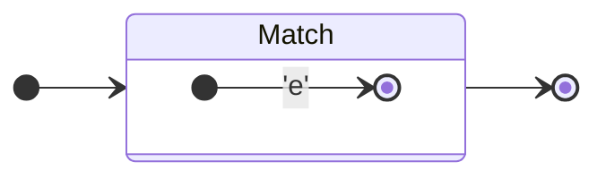
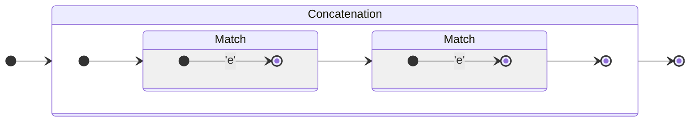
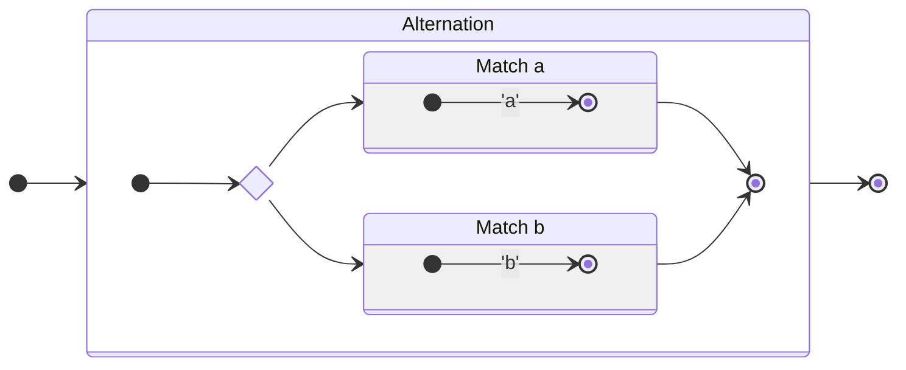
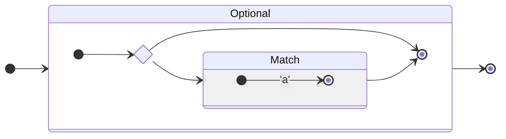
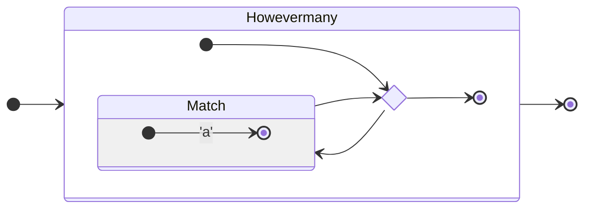
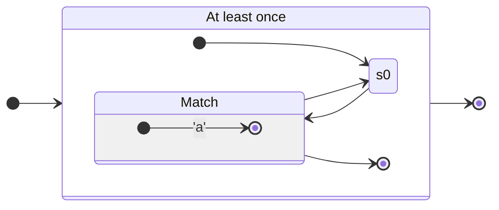

# Efficient RegExp

Heavily inspired by [this](https://swtch.com/~rsc/regexp/regexp1.html).

## How it works

First, we tokenize, parse, and compile the query into a non-deterministic finite automaton (NFA). Then, we have two options: we can convert the NFA into an equivalent DFA, improving runtime performance but slowing down regexp compilation time, or we can use the NFA as a matcher. 

The paper I linked above suggests a solution in between: we use the NFA but cache results if we visit a state that we've already cached before.

## RegExp to NFA conversion

### Match single char

#### Raw
```regexp
e
```

#### Automaton


### Concatenation (appending fragments)

#### Raw
```regexp
ee
```

#### Automaton


### Alternation `|`

#### Raw
```regexp
a|b
```

#### Automaton



### Optional `?`

#### Raw
```regexp
a?
```

#### Automaton


### Howevermany with `*`

#### Raw
```regexp
a*
```

#### Automaton


### At least once `+`

#### Raw
```regexp
a+
```

#### Automaton



## Approach 1: Convert NFA to DFA

### Description

with:
- $ Z $: set of all states 
- $ S $: set all starting states
- $ F $: set all accepting end states
- $ \Sigma $: set of all valid inputs
- $ \Delta \subseteq (Z \times \Sigma) \times Z $: transition relation

> All properties marked $'$ are those of the new DFA.

Now, let
- $ Z' = \mathcal{P}(Z) $, 
- $ S' = \Set{ S } $,
- $ \Delta' \subseteq (Z' \times \Sigma) \times Z' $
- and $ F' = \Set{ x | x \in Z' \land (\vert x \cap F \vert > 0) } $

### Note

The next step after conversion should be minimizing the automaton.


## Approach 3: VM-Based

### Opcodes
