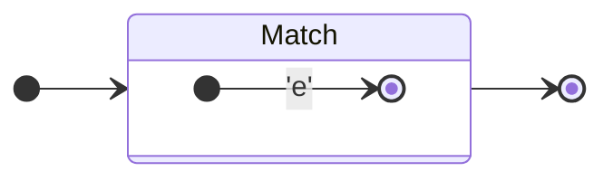
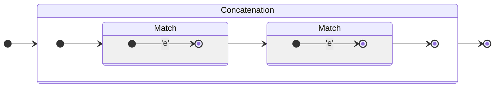
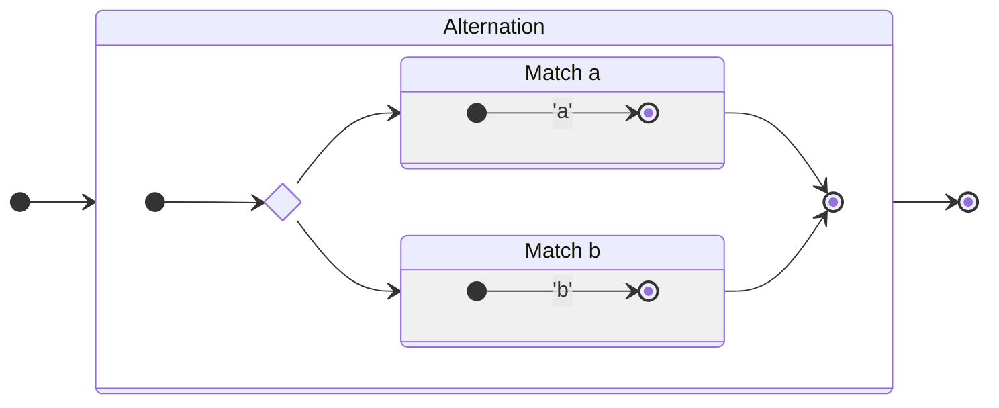
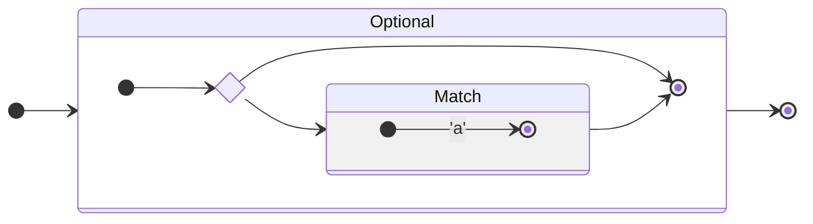
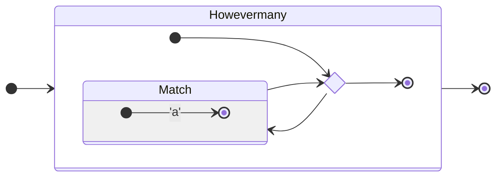
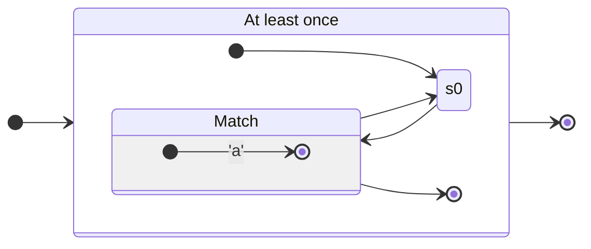

# ~~Efficient~~ RegExp (it's a VM)

## VM approach

This is the solution I went with.

## NFA approach

First, we tokenize, parse, and compile the query into a non-deterministic finite automaton (NFA). Then, we have two options: we can convert the NFA into an equivalent DFA, improving runtime performance but slowing down regexp compilation time, or we can use the NFA as a matcher. 

The paper I linked above suggests a solution in between: we use the NFA but cache results if we visit a state that we've already cached before.

## RegExp to NFA conversion

### Match single char

#### Raw
```regexp
e
```

#### Automaton


### Concatenation (appending fragments)

#### Raw
```regexp
ee
```

#### Automaton


### Alternation `|`

#### Raw
```regexp
a|b
```

#### Automaton



### Optional `?`

#### Raw
```regexp
a?
```

#### Automaton


### Howevermany with `*`

#### Raw
```regexp
a*
```

#### Automaton


### At least once `+`

#### Raw
```regexp
a+
```

#### Automaton

